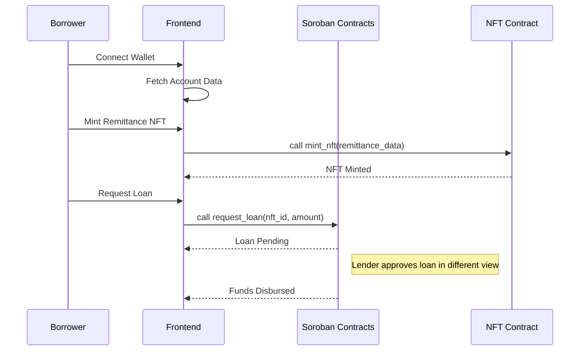

# System Architecture

RemitLend is a decentralized lending platform built on the Stellar network using Soroban smart contracts. It leverages remittance history to establish creditworthiness for migrant workers.

## High-Level Component Interaction

## Core Components

### 1. Smart Contracts (`contracts/`)

- **Remittance NFT**: Stores the borrower's reliability score and payment history hash. It acts as collateral for loans.
- **Lending Pool**: Manages the liquidity provided by lenders. It handles deposits, withdrawals, and tracking of available funds.
- **Loan Manager**: Coordinates the loan lifecycle—request, approval, disbursement, and repayment.

### 2. Backend (`backend/`)

The backend is built with Express.js and TypeScript. Its primary roles include:
- Generating and verifying remittance data (simulated for now).
- Providing metadata for the Remittance NFTs.
- Future integration with off-chain financial APIs (Wise, Western Union, etc.).

### 3. Frontend (`frontend/`)

The frontend is a Next.js application that provides interfaces for:
- **Borrower Dashboard**: Minting NFTs, viewing loan options, managing active loans, and making payments.
- **Lender Dashboard**: Providing liquidity, monitoring pool health, and approving/rejecting loan requests.

## Data Flow: Loan Lifecycle

1. **Onboarding**: Borrower connects their Stellar wallet.
2. **Scoring**: Backend generates a remittance score based on history.
3. **Collateralization**: Borrower mints an NFT containing this score.
4. **Loan Request**: Borrower stakes the NFT to request a loan from the pool.
5. **Funding**: Lenders (or automated logic) approve the loan, and funds are sent to the borrower's wallet.
6. **Repayment**: Borrower pays back the loan through the dashboard.
7. **Release**: Once the loan is fully repaid, the NFT is unlocked and returned to the borrower.

## Security Considerations

- **Non-Custodial**: Users always maintain control of their funds through their Stellar wallets.
- **Transparent**: All loan terms, pool balances, and repayment history are recorded on-chain.
- **Auditable**: Smart contract code is open-source and verifiable on the Stellar network.
