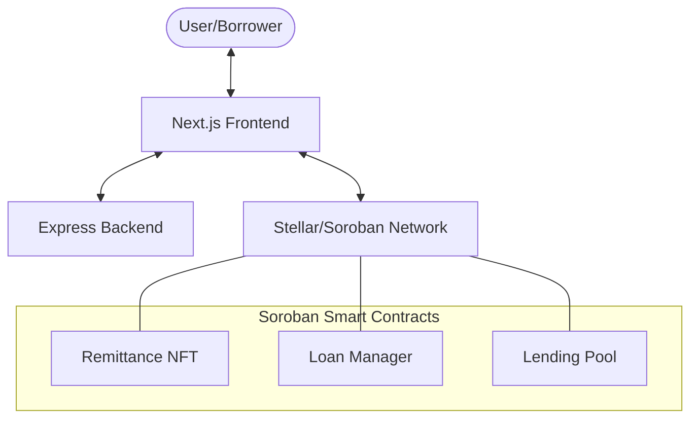

# RemitLend

RemitLend treats remittance history as credit history. Migrant workers prove reliability through monthly transfers, allowing them to receive fair loans without predatory fees. Lenders earn transparent yield on the Stellar testnet.

## 🚀 Vision

Migrant workers often lack traditional credit history in host countries, forcing them towards high-interest payday loans. RemitLend bridges this gap by turning consistent remittance records into an on-chain reliability score, unlocking access to affordable capital.

## 🏗 Project Structure

The repository is organized as a monorepo containing the following components:

- **`backend/`**: Express.js server providing API support and metadata management.
- **`frontend/`**: Next.js web application for borrowers and lenders.
- **`contracts/`**: Soroban (Rust) smart contracts covering loans, pools, and NFTs.

## 🛠 Tech Stack

- **Blockchain**: [Stellar](https://stellar.org) (Soroban)
- **Frontend**: Next.js, TypeScript, Tailwind CSS
- **Backend**: Node.js, Express, TypeScript
- **Wallet**: [Stellar Wallet Kit](https://github.com/stellar/stellar-wallet-kit) (Freighter, etc.)

## 📐 Architecture

The following diagram illustrates the high-level interaction between RemitLend components:



## 🏁 Getting Started

### Prerequisites

- [Node.js](https://nodejs.org/) (v18+)
- [Docker](https://www.docker.com/) (Optional, for easy setup)
- [Rust & Cargo](https://rustup.rs/) (For contract development)
- [Soroban CLI](https://soroban.stellar.org/docs/getting-started/setup)

### Environment Setup

1. **Clone the repository:**
   ```bash
   git clone https://github.com/your-repo/remitlend.git
   cd remitlend
   ```

2. **Backend Configuration:**
   Create a `.env` file in the `backend/` directory:
   ```bash
   cp backend/.env.example backend/.env # If example exists, else create manually
   ```
   Add required variables:
   ```
   PORT=3001
   ```

### Running Locally

#### Using Docker (Recommended)

From the root directory:
```bash
docker compose up --build
```
- Frontend: `http://localhost:3000`
- Backend: `http://localhost:3001`

#### Manual Setup

1. **Start Backend:**
   ```bash
   cd backend
   npm install
   npm run dev
   ```

2. **Start Frontend:**
   ```bash
   cd frontend
   npm install
   npm run dev
   ```

3. **Compile Contracts:**
   ```bash
   cd contracts
   cargo build --target wasm32-unknown-unknown --release
   ```

## 🤝 Contributing

We welcome contributions! Please see our [CONTRIBUTING.md](CONTRIBUTING.md) for guidelines on how to get started.

## 📜 License

This project is licensed under the ISC License.
